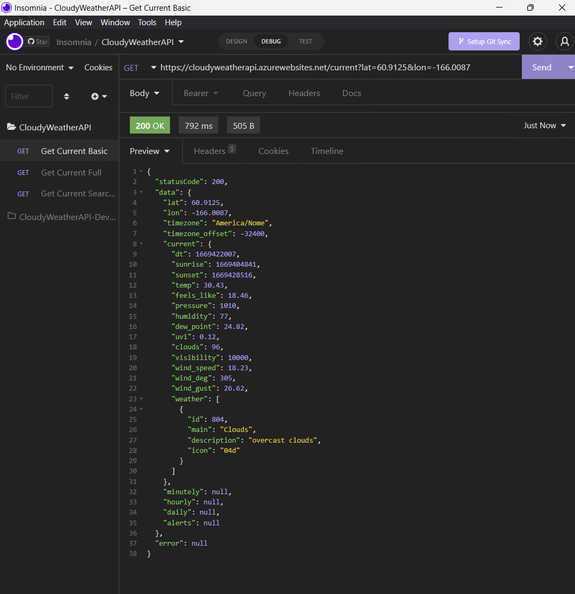

# CloudyWeatherAPI

  

## Description

**CloudyWeather** is a _RESTful API_ for my personal applications that require weather data.

With the sun setting on the Heroku free tier. I have decided to transition some of my projects to Azure. I have a few applications that utilize the OpenWeatherAPI. I decided to take this opportunity to consolidate repetitive code while expanding my knowledge of C# and cloud computing.

Even though a back-end isn't required to interact with the OpenWeatherAPI. I generally interact with the API on the server in the applications that use it; rather than on the client. This allows me to hide API access keys from the clients and to control how often data is fetched from the actual API. I have already repeated similar logic in various applications since prior implementations were monolithic. This project deprecates the existing implementations and they will be refactored to use this implementation.

## Features

**CloudyWeather** is a RESTful API was built using the following:

### Tech-Stack

| Technology                         | Description                | Links                                                                                 |
| ---------------------------------- | -------------------------- | ------------------------------------------------------------------------------------- |
| Memory-safe Programming Language   | C#                         | [Why C#](https://dotnet.microsoft.com/en-us/languages/csharp)                         |
| Development Platform               | Microsoft ASP.NET          | [Web UIs with C#](https://dotnet.microsoft.com/en-us/apps/aspnet)                     |
| Integrated Development Environment | Visual Studio              | [Visual Studio](https://visualstudio.microsoft.com/)                                  |
| Cloud Services Provider            | Microsoft Azure            | [Azure Cloud Computing](https://azure.microsoft.com/en-us/)                           |
| Hosting Service                    | Azure App Service          | [App Service](https://azure.microsoft.com/en-us/pricing/details/app-service/windows/) |
| REST API                           | Open Weather API - OneCall | [OneCall](https://openweathermap.org/api/one-call-3)                                  |
| API Testing | Insomnia | [Insomnia Rest](https://insomnia.rest/)|

## Deployment / Usage

CloudyWeather is hosted on [Azure](https://azure.microsoft.com/en-us/) using [App Services](https://azure.microsoft.com/en-us/pricing/details/app-service/windows/) and uses the free tier.

Searches are conducted using latitude and longitude coordinates only
since that is what the underlying [OneCall API](https://openweathermap.org/api/one-call-3) uses to fetch data.

Currently two endpoints exist: `/current` and `/current-full`.

The `current` endpoint does not return the minutely, hourly or daily forecasts and is a lighter call.

Using basic query parameters, we can pass the desired coordinates.
Ex:`/current?lat=60.9125&lon=-166.0087`

Data is cached for 10 minutes and unique (_doesn't currently exist in cache_) or expired searches are limited to 60 calls per minute.

## Screenshot

## Demo

A demo API can be accessed at [https://cloudyweatherapi.azurewebsites.net](https://cloudyweatherapi.azurewebsites.net)

## Future Improvements

The API is a functional MVP but doesn't offer a lot of flexibility at the current moment. We could make changes to accept different parameters for the units and language as the defaults cannot currently be overridden. Since this is really for my personal use, I don't have a need to make changes at the current moment, but this is something that could be improved upon in the future.

## How to Contribute

Not accepting contributions for this particular project, but if you wish to collaborate feel free to reach out!

## Contact

If you have any questions please feel free to email me @ [anthonytropeano@protonmail.com](mailto:anthonytropeano@protonmail.com)

## License

This project is licensed under the MIT License and a copy can be found here: [View License](./LICENSE).
